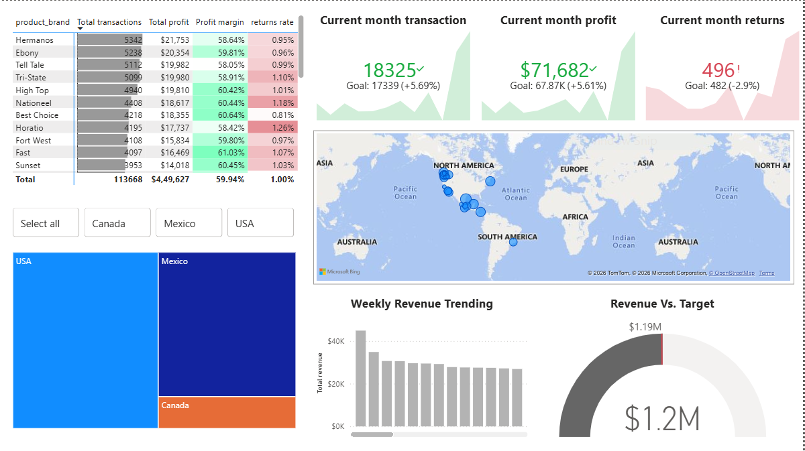

# Market Analysis Dashboard
## Overview
This project is a Market Analysis Dashboard created using Power BI.
The dashboard analyzes sales, profit, returns, and revenue trends across different countries and products.

## Tools & Technologies Used
- Microsoft Power BI Desktop
- Power Query
- DAX (Data Analysis Expressions)
- CSV Files
- GitHub

## Dataset Information
The dataset is a public market transactions dataset used for portfolio and learning purposes.
- Market_Calendar.csv
- Market_Customers.csv
- Market_Products.csv
- Market_Regions.csv
- Market_Returns_1997-1998.csv
- Market_Stores.csv
- Market_Transactions_1997.csv
- Market_Transactions_1998.csv

## Repository Structure
Market_Analysis_PowerBi/
├── Data/
├── Report/
├── Screenshots/
└── README.md

## Dashboard Features
- Total Revenue
- Total Profit
- Total Transactions
- Return Rate
- Revenue by Country
- Weekly Revenue Trend
- Revenue vs Target
- Top Products by Revenue

## Key Insights
- Mexico is achieving revenue targets.
- Canada shows lower performance compared to other countries.
- Weekly revenue demonstrates consistent business growth.

## Dashboard Preview
### Sales Analysis

## How to Open the Project
1. Download this repository.
2. Open the `.pbix` file in Power BI Desktop.
3. Refresh the data if needed.

## Skills Demonstrated
- Data Modeling
- Star Schema Design
- Data Cleaning with Power Query
- DAX Measures and KPIs
- Dashboard Design
- Business Insight Generation
- GitHub Project Documentation
